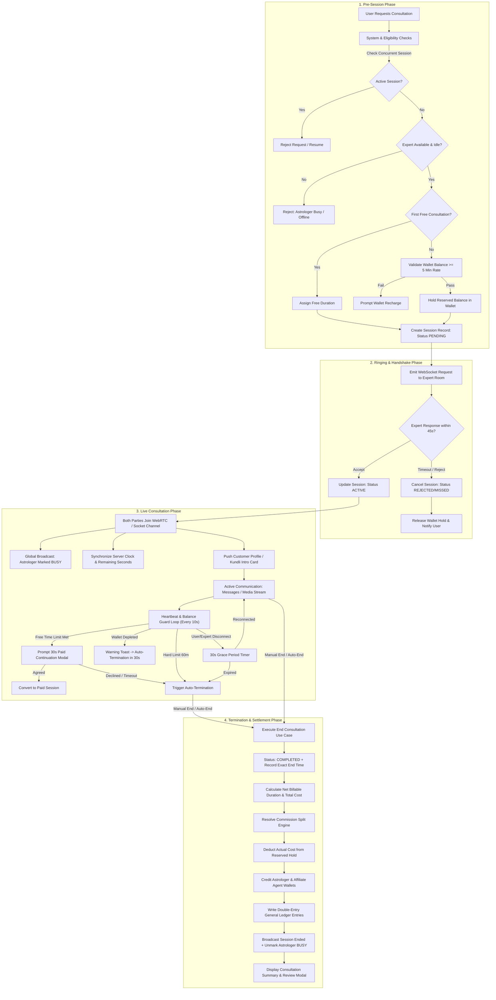

# Consultation Session Architecture & Lifecycle Specification

This document details the complete end-to-end blueprint for how **Consultation Sessions (Chat, Audio Call, Video Call)** are designed, managed, and executed across **Astrology in Bharat**.

---

## 1. Executive Architecture Overview

---

## 2. Detailed Phase Specifications

### Phase 1: Pre-Session Validation & Balance Hold

Before any consultation request is dispatched to an astrologer, strict integrity checks must succeed in an ACID database transaction.

1. **Active Consultation Concurrency Guard:**
   - A client cannot start or hold more than one `PENDING` or `ACTIVE` session across the entire platform.
   - If an active session exists with the same astrologer, redirect/resume that session.
   - If an active session exists with a different astrologer, reject immediately.

2. **Astrologer Availability Guard:**
   - Astrologer status must be `is_available: true`.
   - Astrologer must not have any other `PENDING` or `ACTIVE` sessions (Chat, Call, or Video).

3. **Monetary Hold & Free Consultation Logic:**
   - **First Free Chat Check:** If `FREE_CHAT_ENABLED` is active and client has 0 completed consultations, grant configured free minutes (e.g., 5 minutes) without wallet holds.
   - **Paid Consultation Check:** Minimum wallet balance required = `5 × price_per_minute`.
   - **Pessimistic Wallet Hold:** Execute a `HOLD` transaction. Move funds from `wallet.balance` to `wallet.reserved_balance` with a dedicated transaction record.

4. **Record Creation:**
   - Instantiate session record with `status: PENDING`, `price_per_minute`, `is_free`, `free_minutes`, and client birth details metadata.

---

### Phase 2: Ringing & Handshake

1. **Real-time Dispatch:**
   - Backend emits `new_chat_request` or `incoming_call` to the astrologer's private socket room (`expert_{id}`).
   - Astrologer frontend displays an urgent, audio-enabled notification modal.

2. **Timeouts & Rejections:**
   - **Timeout Limit:** 45 seconds to accept.
   - **Action on Reject / Timeout:**
     - Status updated to `REJECTED` or `EXPIRED`.
     - Any held wallet funds are immediately unreserved and returned to `wallet.balance`.
     - Client receives immediate push notice.

3. **Action on Accept:**
   - Astrologer accepts and transitions to room `/chat/room/[id]` or `/call/room/[id]`.

---

### Phase 3: Live Session Synchronization & Guard Loop

1. **Room Activation:**
   - Both participants join Socket.IO room `room_{sessionId}` (and WebRTC mesh/SFU room for Call/Video).
   - Backend executes `activateSession()`:
     - Sets `start_time = NOW()` and `status = ACTIVE`.
     - Calculates `maxMinutes` affordable via wallet funds.
     - Emits `session_activated` with synchronized server timestamps (`startedAt`, `expiresAt`, `remainingSeconds`).
     - Emits `expert_busy_changed: { is_busy: true }` globally to lock user-facing listings.
     - Automatically posts the client's Kundli/Horoscope Intro Card into the conversation.

2. **Continuous Server-Side Guard Loop (Interval: 10s):**
   - **60-Minute Hard Cap:** Platform forces session end at 60 minutes to prevent runaway processes.
   - **Free-to-Paid Boundary:**
     - At `free_minutes - 1m`, notify client.
     - At `free_minutes`, emit `free_time_ending_soon` modal.
     - Client has 30 seconds to confirm continuation via wallet balance. If no response or insufficient funds, backend terminates session cleanly.
   - **Continuous Balance Guard:**
     - If unreserved balance is insufficient for the next minute, emit `balance_warning`.
     - Auto-terminate within 30 seconds if recharge is not completed.
   - **Graceful Disconnection Guard:**
     - If either client or expert socket drops during an active session, start a 30-second reconnection timer.
     - If user reconnects within 30 seconds, cancel timer.
     - If 30 seconds elapse without reconnection, auto-terminate session cleanly.

---

### Phase 4: Termination, Financial Settlement & Ledger

1. **Duration Calculation:**
   - Exact duration computed in milliseconds using server timestamps:
     $$\text{actualMinutes} = \frac{\text{end\_time} - \text{start\_time}}{60000}$$
     $$\text{billableMinutes} = \max(0, \text{actualMinutes} - \text{free\_minutes})$$
     $$\text{totalCost} = \text{round}(\text{billableMinutes} \times \text{price\_per\_minute}, 2)$$

2. **Commission Resolution Engine:**
   - Execute dynamic commission rule resolver (`CommissionRule`):
     - **Platform Fee:** Percentage or flat rate based on tier.
     - **GST:** Configured rate on the platform fee.
     - **Seller's Affiliate Agent Commission:** If astrologer was referred.
     - **Buyer's Affiliate Agent Commission:** If client was referred.
     - **Astrologer Net Earning:**
       $$\text{Earning}_{\text{expert}} = \text{totalCost} - \text{Fee}_{\text{platform}} - \text{GST} - \text{Comm}_{\text{seller\_agent}} - \text{Comm}_{\text{buyer\_agent}}$$

3. **Atomic Wallet Settlement:**
   - **Client:** Deduct `totalCost` from reserved hold; release any unspent reserved balance back to main balance.
   - **Astrologer:** Credit `Earning_expert` directly to astrologer wallet.
   - **Agents:** Credit respective affiliate balances.
   - **General Ledger:** Dispatch asynchronous audit ledger entries (`GeneralLedgerEntry`) for all debits and credits.

4. **Teardown & Rating:**
   - Emit `session_ended` to room with financial breakdown.
   - Emit `expert_busy_changed: { is_busy: false }` globally.
   - Open Consultation Summary & 5-Star Review Modal on client screen.

---

## 3. Session State Machine

| Current State | Event                            | Next State             | Actions Triggered                                                |
| :------------ | :------------------------------- | :--------------------- | :--------------------------------------------------------------- |
| **NONE**      | Client initiates                 | **PENDING**            | Wallet balance held, notification sent to astrologer             |
| **PENDING**   | Astrologer accepts               | **ACTIVE**             | `start_time` set, global busy flag set, timers started           |
| **PENDING**   | Astrologer rejects / 45s timeout | **REJECTED / EXPIRED** | Wallet hold released, user notified                              |
| **ACTIVE**    | Either user clicks End / Timeout | **COMPLETED**          | Billing settled, wallet credited/debited, astrologer freed       |
| **ACTIVE**    | Disconnect > 30s                 | **COMPLETED**          | Auto-ended due to lost connection, bill settled for elapsed time |
| **ACTIVE**    | Admin terminates                 | **TERMINATED**         | Force-ended by moderation, audit log written                     |

---

## 4. Key Engineering Standards & Guardrails

1. **Zero Client Trust:** All timers, balance deductions, and session terminations are computed on the backend server clock. Client timestamps are ignored.
2. **Idempotent Termination:** `EndSessionUseCase` wraps execution in an ACID transaction with pessimistic row locking to prevent duplicate billing or race conditions.
3. **Double Entry Bookkeeping:** Every consultation deduction must map to a `Transaction` row and a matching `CommissionSplit` + `GeneralLedgerEntry`.
4. **Resilience:** If network drops occur, the 30-second grace period protects users from immediate accidental termination while preventing lingering ghost sessions.
