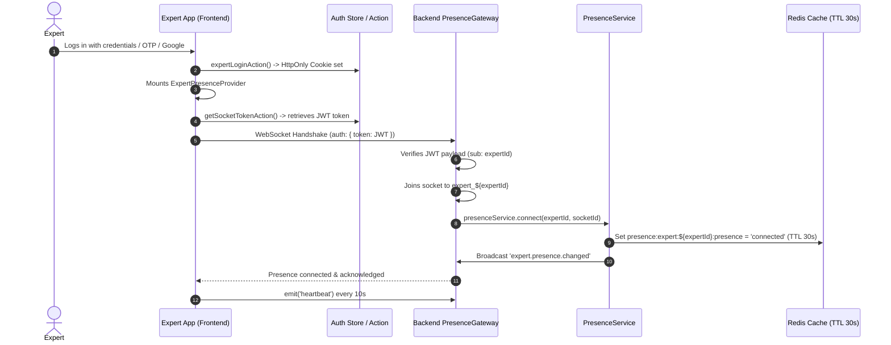
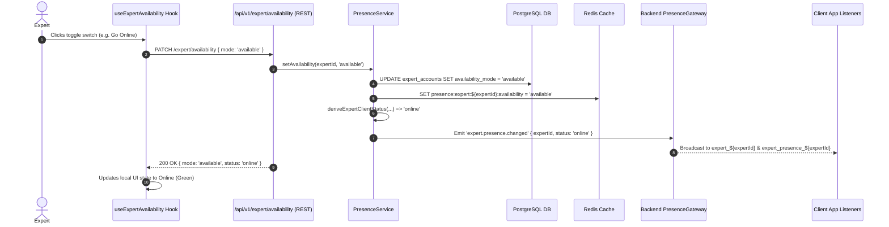
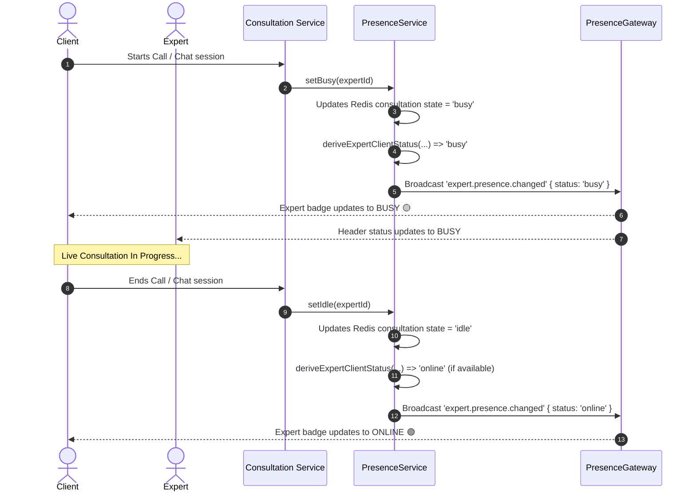
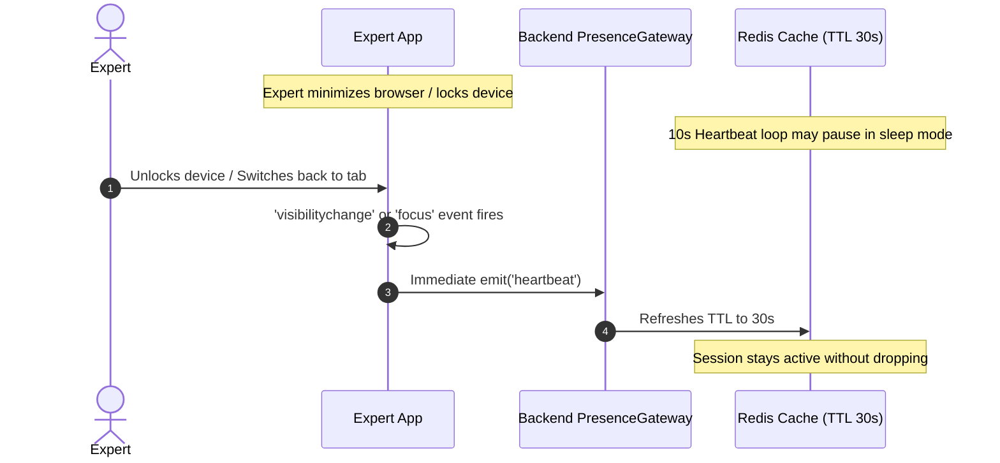

# Expert Realtime Presence & Availability — Flows and Scenarios

This document outlines the complete architectural flows, state lifecycle, and edge-case scenarios for Experts on **Astrology in Bharat**.

---

## 1. Core State Model & Truth Table

An expert's client-facing status (`online`, `busy`, `offline`) is dynamically derived on the backend using three independent inputs:

1. **Realtime Presence** (`connected` | `disconnected`): Active WebSocket connection + valid 10s heartbeat in Redis (30s TTL).
2. **Availability Mode** (`available` | `unavailable`): Expert's manual toggle switch persisted in Postgres DB & cached in Redis.
3. **Consultation State** (`idle` | `busy`): Live chat or call session status in consultation domain.

### Status Derivation Matrix

| Realtime Presence | Availability Mode | Consultation State | Derived Client Status | Can Receive New Consultations? |
| :--- | :--- | :--- | :--- | :--- |
| **`connected`** | **`available`** | **`idle`** | 🟢 **`online`** | ✅ Yes |
| **`connected`** | **`available`** | **`busy`** | 🟡 **`busy`** | ❌ No (in active session) |
| **`connected`** | **`unavailable`** | **`busy`** | 🟡 **`busy`** | ❌ No (finishing active session) |
| **`connected`** | **`unavailable`** | **`idle`** | 🔴 **`offline`** | ❌ No (manual toggle OFF) |
| **`disconnected`** | *any* | *any* | 🔴 **`offline`** | ❌ No (no active socket/heartbeat) |

---

## 2. End-to-End Scenarios & Flow Diagrams

### Scenario A: Login & Socket Session Handshake

When an expert logs into the Expert App:

---

### Scenario B: Manual Availability Mode Toggle (ON / OFF)

When the expert clicks the status toggle switch in the dashboard header:

---

### Scenario C: Live Consultation Lifecycle (Idle $\rightarrow$ Busy $\rightarrow$ Idle)

When an expert accepts a consultation call or chat:

---

### Scenario D: Toggling Offline Mid-Consultation

If an expert finishes their shift and toggles their switch to **Offline** while in an active call:

1. **DB/Redis Updated:** `availability_mode` is updated to `'unavailable'`.
2. **Consultation Continues:** Active call/chat does **not** get interrupted or terminated.
3. **Status Stays `busy`:** While consultation is active, derived status remains `busy` (users see they are occupied).
4. **Session Ends:** When the call concludes, `consultationState` becomes `'idle'`. Since `availabilityMode` is `'unavailable'`, status drops directly to **`offline`** 🔴 without ever reverting to `online`.

---

### Scenario E: Tab Backgrounding, Sleep & Wakeup (Visibility Sync)

When mobile or desktop browsers suspend background tabs:

---

### Scenario F: Browser Crash, Network Loss & Auto-Recovery

What happens if an expert loses internet connection or forcefully kills the app:

#### 1. Graceful Close (Tab / Window Closed)
- Browser closes WebSocket connection.
- Backend `PresenceGateway.handleDisconnect(client)` fires immediately.
- Calls `presenceService.disconnect(expertId, socket.id)`.
- Redis presence set to `'disconnected'` $\rightarrow$ Status immediately broadcasted as **`offline`** 🔴.

#### 2. Ungraceful Crash (Device Dies / Connection Drops Silently)
- Socket cannot send a disconnect packet.
- Redis key `presence:expert:${expertId}:presence` has a strict **30-second TTL**.
- Because no heartbeat was received in 10–20 seconds, Redis key naturally expires.
- Client queries and discovery APIs evaluate missing Redis presence as `disconnected` $\rightarrow$ Status becomes **`offline`** 🔴 within $\le 30$ seconds.

#### 3. Automatic Recovery
- Network restores $\rightarrow$ Socket automatically reconnects with auth token.
- Socket `connect` listener immediately emits `heartbeat`.
- Redis key recreated $\rightarrow$ Status automatically restored to **`online`** 🟢.

---

## 3. Frontend Architecture Summary (Expert App)

| Component / Hook | File | Responsibility |
| :--- | :--- | :--- |
| **Socket Suite** | [`src/lib/socket/`](file:///home/rgstartup/AIB/project/frontend/apps/expert/src/lib/socket/) | Authenticated root socket instance, event typings, named exports. |
| **Token Action** | [`src/actions/auth.ts`](file:///home/rgstartup/AIB/project/frontend/apps/expert/src/actions/auth.ts) | Reads HttpOnly cookie to supply token for socket handshake. |
| **Presence Provider** | [`src/providers/ExpertPresenceProvider.tsx`](file:///home/rgstartup/AIB/project/frontend/apps/expert/src/providers/ExpertPresenceProvider.tsx) | Global 10s heartbeat cycle, tab visibility and focus listeners. |
| **Availability Hook** | [`src/hooks/useExpertAvailability.ts`](file:///home/rgstartup/AIB/project/frontend/apps/expert/src/hooks/useExpertAvailability.ts) | State management for toggle, REST API integration, realtime presence listeners. |
| **API Client** | [`src/actions/api.ts`](file:///home/rgstartup/AIB/project/frontend/apps/expert/src/actions/api.ts) | Standardized `Result<T>` fetch client for expert application. |
