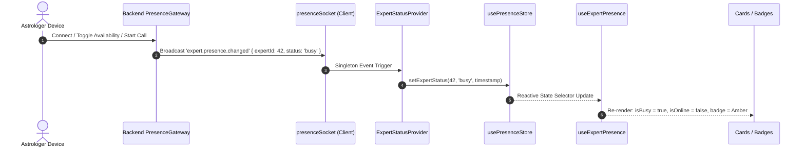
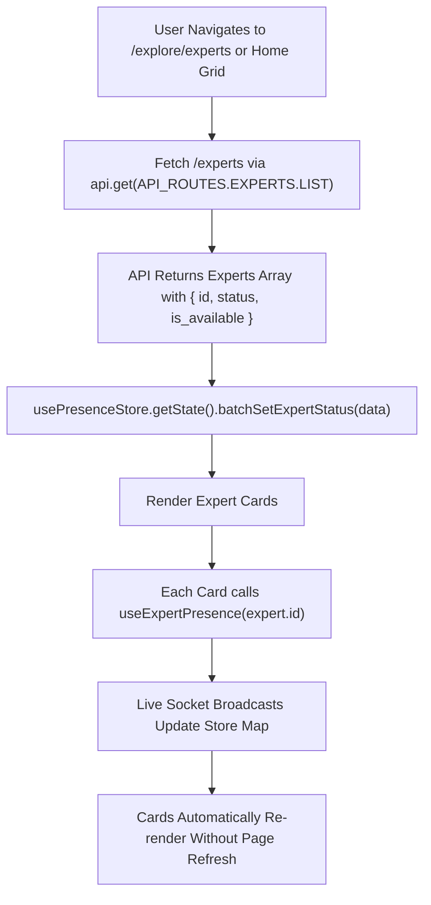
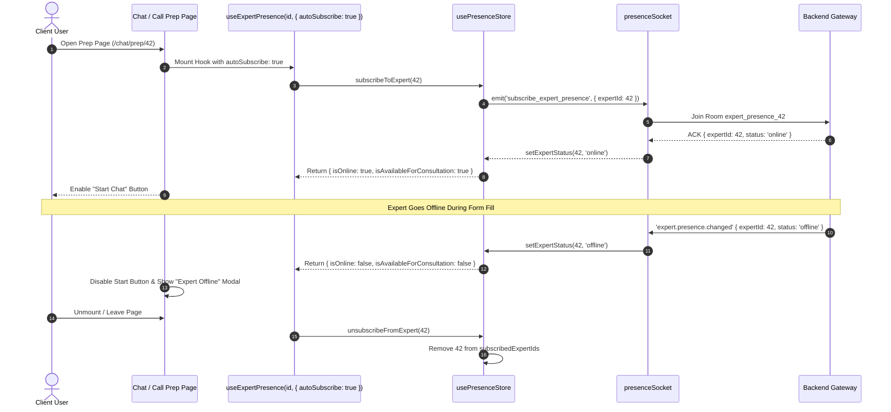
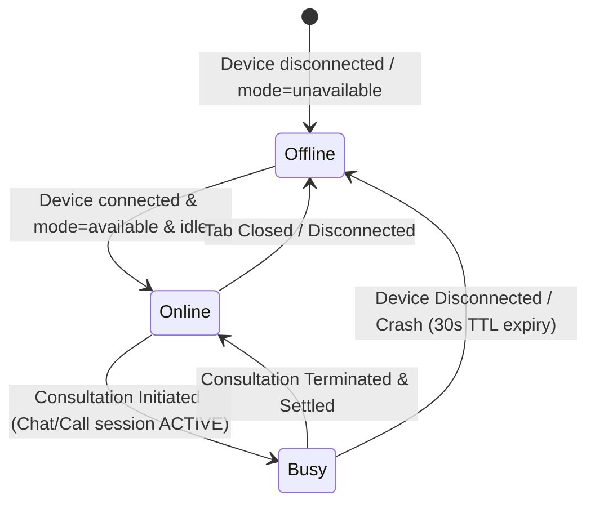
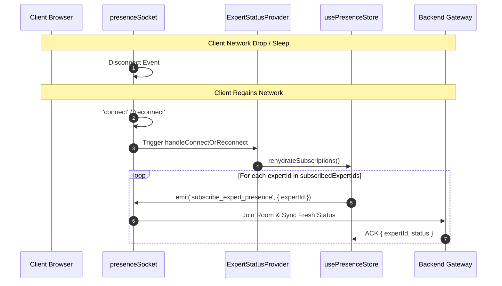

# Frontend Realtime Presence & Availability Architecture

## 1. Overview & Objectives

This document specifies the architecture, data flow, WebSocket lifecycle, Zustand state management, and component integration for **Realtime Expert Presence & Availability Tracking** in the Astrology in Bharat frontend client application.

The presence tracking system provides sub-second synchronization of astrologer/expert availability (`online`, `busy`, `offline`) across marketplace cards, explore filters, search results, individual expert detail pages, and consultation prep rooms without N+1 socket listeners or UI flickering.

> For a non-technical conceptual explanation with analogies, see [presence-tracking-layman-guide.md](file:///home/rgstartup/AIB/project/frontend/docs/presence-tracking-layman-guide.md).

---

## 2. Domain Model & Authoritative Status Derivation

The client-facing status is derived by the backend presence system from three independent states:

1. **Realtime Presence (`'online' | 'offline'`):** Ephemeral WebSocket connectivity in Redis.
2. **Availability Mode (`'available' | 'unavailable'`):** Persistent manual preference in PostgreSQL.
3. **Consultation State (`'idle' | 'busy'`):** Authoritative session state managed by the consultation domain.

### Authoritative Derivation Truth Table

| Ephemeral Realtime | Persistent Mode | Consultation State | Derived Client Status | `isAvailableForConsultation` |
| :----------------- | :-------------- | :----------------- | :-------------------- | :--------------------------- |
| `offline`          | `available`     | `idle`             | `offline`             | `false`                      |
| `offline`          | `available`     | `busy`             | `offline`             | `false`                      |
| `offline`          | `unavailable`   | `idle`             | `offline`             | `false`                      |
| `offline`          | `unavailable`   | `busy`             | `offline`             | `false`                      |
| `online`           | `available`     | `idle`             | **`online`**          | **`true`**                   |
| `online`           | `available`     | `busy`             | **`busy`**            | `false`                      |
| `online`           | `unavailable`   | `idle`             | `offline`             | `false`                      |
| `online`           | `unavailable`   | `busy`             | `offline`             | `false`                      |

---

## 3. Frontend Architecture & Modular Organization

```
frontend/apps/client/src/
├── lib/
│   ├── socket/                        # Modular Socket Engine
│   │   ├── config.ts                  # URLs, transports, reconnect options
│   │   ├── types.ts                   # ExpertClientStatus, event payloads, ACK types
│   │   ├── presence.socket.ts         # Root namespace socket & presence helpers
│   │   ├── chat.socket.ts             # /chat namespace socket
│   │   ├── merchant.socket.ts         # /merchant namespace socket
│   │   └── index.ts                   # Explicit tree-shakeable named exports
│   ├── socket.ts                      # DEPRECATED monolithic file
│   └── api-routes.ts                  # API_ROUTES (EXPERTS.LIST = '/experts')
├── store/
│   ├── presenceStore.ts               # Centralized Zustand presence map & subscriptions
│   └── expertListStore.ts             # Marketplace filter & pagination store
├── hooks/
│   └── useExpertPresence.ts           # Reactive presence selector hook
└── providers/
    └── ExpertStatusProvider.tsx       # Singleton root listener & reconnect rehydration
```

---

## 4. End-to-End Component & Data Flows

### Flow 1: Expert Global Broadcast & Centralized Store Sync



---

### Flow 2: Marketplace Discovery & Listing Presence Flow

Public expert listings use the `/experts` endpoint (via `API_ROUTES.EXPERTS.LIST`), seed initial statuses into `usePresenceStore`, and react to live socket updates:



---

### Flow 3: Dedicated Detail & Prep Page Targeted Room Subscription

When a user views a specific expert (`/consultants/[id]`, `/chat/prep/[id]`, `/call/prep/[id]`), `useExpertPresence` enables `autoSubscribe: true`:



---

### Flow 4: Consultation State Transitions



---

### Flow 5: Disconnection & Reconnection Rehydration



---

## 5. Components & Integration Reference

| Component / Hook | Role | Presence Source |
| :--- | :--- | :--- |
| `ExpertStatusProvider` | Root layout provider (singleton listener) | Listens to `expert.presence.changed`, dispatches to `usePresenceStore` |
| `presenceStore` | Global Zustand state store | Maintains `presenceMap` and `subscribedExpertIds` |
| `useExpertPresence` | Custom React hook | Reads from `usePresenceStore`, manages optional room subscriptions |
| `ExpertCard` | Home & general listing card | `useExpertPresence(id, { initialStatus: is_available })` |
| `ExploreExpertCard` | Marketplace exploration card | `useExpertPresence(expert.id, { initialStatus: expert.is_available })` |
| `useExpertDetails` | Expert public detail page logic | `useExpertPresence(expertId, { autoSubscribe: true })` |
| `chat/prep/[id]/page` | Pre-chat form & readiness screen | `useExpertPresence(id, { autoSubscribe: true })` |
| `call/prep/[id]/page` | Pre-call audio/video device test | `useExpertPresence(id, { autoSubscribe: true })` |
| `RecommendedExperts` | Dashboard recommended widget | Seeds `usePresenceStore` on initial fetch |

---

## 6. API Route Standards

- **Discovery Endpoint:** `GET /api/v1/experts` (`API_ROUTES.EXPERTS.LIST`)
- **Single Expert Endpoint:** `GET /api/v1/experts/:id` (`API_ROUTES.EXPERTS.ACCOUNT`)
- **Presence Direct Lookup:** `GET /api/v1/expert/presence/:id`
- **Deprecated Endpoint:** `GET /api/v1/expert/account/list` (Do not use).
