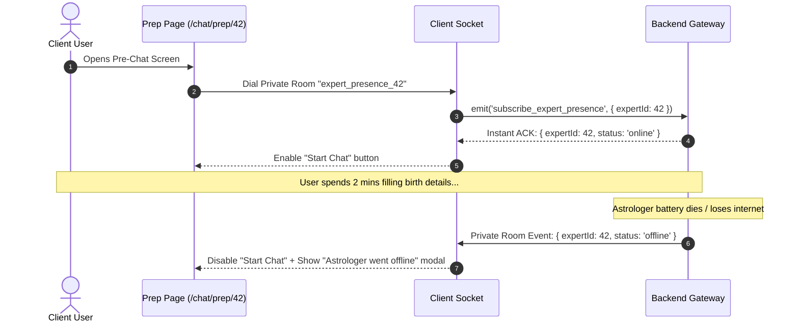

# Realtime Presence & Availability — Layman Concept Guide

> **Quick Summary:** A simple, non-technical explanation of how astrologer online/offline/busy tracking works across Astrology in Bharat, from backend Redis to frontend Next.js/React.

---

## 1. The Core Analogy: Radio Broadcast vs. Private Phone Line

```
┌─────────────────────────────────────────────────────────────┐
│ 1. THE PUBLIC RADIO (Browse / Marketplace Feed)             │
│    - One transmission tower shouts to all clients.          │
│    - "Astrologer 5 just went Busy!"                         │
│    - 0 room connections needed per card.                    │
└──────────────────────────────┬──────────────────────────────┘
                               │
                               ▼
┌─────────────────────────────────────────────────────────────┐
│ 2. THE PRIVATE DIRECT LINE (Booking / Detail / Prep Page)   │
│    - Client dials private room for 1 specific Astrologer.   │
│    - Instant check: "Are they online right this second?"    │
│    - Protects wallet and prevents booking race-conditions.  │
└─────────────────────────────────────────────────────────────┘
```

---

## 2. How the Backend Decides Status (The 3-Piece Puzzle)

Every second, the backend checks three independent questions:

```
┌──────────────────────────────────┐
│ 1. Device Connected? (Redis)     │  Is app open? Ping heartbeat active?
├──────────────────────────────────┤
│ 2. Switch Turned ON? (Postgres)  │  Did astrologer click "Available"?
├──────────────────────────────────┤
│ 3. In Call Right Now? (Domain)   │  Are they busy talking to another client?
└─────────────────┬────────────────┘
                  │
                  ▼
┌──────────────────────────────────┐
│ RESULTING STATUS                 │
│ • Online (Green)  -> Ready       │
│ • Busy (Amber)    -> In call     │
│ • Offline (Gray)  -> Unavailable │
└──────────────────────────────────┘
```

### The Math:
1. **`Online` (Green):** Connected + Switch ON + Not in call.
2. **`Busy` (Amber):** Connected + Switch ON + Currently in call.
3. **`Offline` (Gray):** Switch OFF, or tab closed, or internet lost for >30 seconds.

---

## 3. Flow A: Browsing the Marketplace (The "Radio Broadcast")

When a user scrolls through 50 astrologers on the home feed:

1. **Initial Page Load:** User opens the app. The server sends the list of astrologers with their current status.
2. **Local Cache (`presenceStore`):** The frontend stores this status map in local memory.
3. **Live Radio Push:**
   - Astrologer #12 takes a call.
   - The backend broadcasts on the public radio channel: `expert.presence.changed` $\rightarrow$ `{ expertId: 12, status: 'busy' }`.
   - The frontend's single listener catches it and flips card #12 to **Amber (In Consultation)**.
4. **Efficiency:**
   - **Zero individual socket rooms joined.**
   - 1 single listener handles 100+ cards simultaneously.

---

## 4. Flow B: Pre-Chat / Booking Page (The "Private Direct Line")

When a user clicks **"Chat with Acharya Sharma"** (`/chat/prep/42`):



---

## 5. Why Do We Need the Private Room? (Why Not Just Radio?)

### 1. Direct Links & Bookmarks (The "Silence" Problem)
- **The Radio only shouts when something CHANGES.**
- If Acharya Sharma came online 2 hours ago and remained online, the radio is silent.
- If a user opens a direct link from WhatsApp (`/chat/prep/42`), their phone memory is empty.
- **The Private Line** immediately returns an instant ACK confirmation: *"Yes, he is online right now."*

### 2. Money & Wallet Protection (No Booking Clashes)
- If two users open the same astrologer's prep screen at 2:00 PM:
  - User A clicks "Start Chat" at 2:01 PM $\rightarrow$ Astrologer becomes `busy`.
  - User B is still typing their birth chart details at 2:01 PM.
  - User B's screen instantly turns **Amber (In Consultation)** and disables the Start button.
  - User B is prevented from initiating a call that would immediately fail.

### 3. Scaling to 10,000+ Astrologers
- On a large platform with 10,000 astrologers:
  - Hundreds of status transitions occur every minute.
  - Sending every status change to every user on the booking screen causes battery drain and lag.
  - The booking screen focuses solely on the **1 astrologer** the user is paying for.

---

## 6. Quick Comparison Cheat Sheet

| Feature | Marketplace / Feed (Radio) | Booking / Prep Page (Private Line) |
| :--- | :--- | :--- |
| **Channel Used** | Public Broadcast (`expert.presence.changed`) | Dedicated Room (`expert_presence_42`) |
| **Number of Rooms Joined** | **0 rooms** (Root namespace only) | **1 room** (Specific astrologer) |
| **Instant Live Check (ACK)** | No (uses initial API response + live stream) | **Yes** (Server confirms live state immediately) |
| **Purpose** | Fast, lightweight browsing without lag | Bulletproof transaction & race-condition safety |
| **Memory Cleanup** | Persists in global `presenceStore` | Automatically leaves room on page exit |
